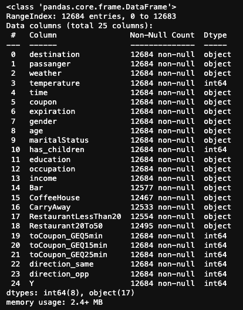

# Will a Customer Accept the Coupon?

In this project, the focus is on analyzing customer responses to driving coupons delivered through a mobile application. The dataset, sourced from a survey on Amazon Mechanical Turk, encompasses various driving scenarios, each associated with specific attributes such as gender, age, marital status, number of children, education, occupation, annual income, and driving habits related to different types of coupons (e.g., restaurants, coffee houses, bars).

The overarching goal is to understand the factors influencing a driver's decision to accept or reject a coupon. Scenarios include considerations of proximity to the business, time, weather, presence of passengers, and the specific type of coupon. For instance, questions may arise around whether drivers are more likely to accept a coupon for a restaurant, coffee house, or bar. Moreover, factors such as the age and gender of the driver, the presence of children, and the urgency of the destination are considered.

The analysis involves employing visualizations, statistical summaries, and probability distributions to distinguish between customers who accepted driving coupons and those who did not. Potential questions to address include:

Demographic Influence: Does the age, gender, marital status, education, occupation, or annual income of a driver impact their likelihood of accepting a coupon?

Driving Habits: Are there patterns in the number of times a driver goes to a restaurant, coffee house, bar, or engages in takeaway food purchases that correlate with coupon acceptance?

Location and Urgency: How does the location of the user, destination, and venue influence coupon acceptance? Does the urgency of the destination play a role?

Weather and Time: Are drivers more inclined to accept coupons during certain weather conditions or times of the day?

Passenger Presence: Does the presence of passengers, such as a partner, children, or friends, affect coupon acceptance?

## Data Analysis and Preprocessing Summary

In the initial phase of the analysis, the dataset from the 'coupons.csv' file was loaded into a pandas DataFrame, and the 'car' attribute, which was missing the majority of values, was dropped. The dataset includes diverse attributes such as destination, passenger, weather, temperature, time, coupon type, expiration, gender, age, marital status, presence of children, education, occupation, income, and more.

The investigation revealed some missing values in attributes related to different coupon types (e.g., 'Bar', 'CoffeeHouse', 'CarryAway', 'RestaurantLessThan20', 'Restaurant20To50'). These missing values will need to be addressed during further analysis. Below is a sample info on the dataset.

The dataset provides valuable insights into user behavior and preferences, with detailed information on various driving scenarios and coupon acceptance. Key observations include:

The majority of destinations are categorized as 'No Urgent Place,' with passengers often traveling alone.
Sunny weather is predominant, and the temperature distribution is skewed towards 80 degrees Fahrenheit.
The dataset comprises coupons for different establishments, with 'Coffee House' being the most prevalent, followed by 'Restaurant(<20)', 'Carry out & Take away', 'Bar', and 'Restaurant(20-50)'. Subsequently, missing values in the 'Bar', 'CoffeeHouse', 'CarryAway', 'RestaurantLessThan20', and 'Restaurant20To50' columns were identified. The decision to drop the 'car' attribute was also justified, given the significant number of missing values.

Look the screenshots of the results below. The first image on the left shows the attributes with null values where we can observe the car attribute only contains 108 non-null values. It is clear this attribute will not be useful to our analysis. The image on the right shows the remaining attributes with null values after removing the car attribute.

 

Further preprocessing steps included cleaning the 'passenger' column by removing parentheses and converting the 'temperature' column to a numerical format. In terms of coupon acceptance, approximately 56.8% of the total observations chose to accept the coupon, indicating a moderate acceptance rate.

To visually represent the data, a bar plot was used to visualize the count of accepted coupons for each coupon type, providing a clear overview of user preferences. As well as the representation of count of coupons that were not accepted, displayed in red. 

 

This initial analysis sets the stage for a deeper exploration of factors influencing coupon acceptance, addressing missing values, and uncovering patterns within the dataset. Further steps will involve statistical summaries, exploratory data analysis, and the development of insights to distinguish between customers who accepted and those who did not accept driving coupons.

## Investigating the Bar Coupons

In this section, the focus was on exploring the behavior of customers who accepted bar-related coupons. The following key analysis were conducted:

### Creating a subset for Bar Coupons:

A new DataFrame was created specifically for customers who chose bar-related coupons. This subset included various attributes such as destination, passenger type, weather conditions, temperature, time, and more.

### Proportion of Bar Coupons Accepted:

The proportion of bar coupons that were accepted was calculated. Approximately 41.0% of the customers who received bar coupons accepted them. The acceptance rates were compared between customers who visited bars three or fewer times a month and those who visited more frequently. A clear distinction emerged, with a higher acceptance rate (76.88%) observed among customers who frequented bars more often.

   

### Comparing Acceptance Rates Based on Age and bar visits frequency:

The acceptance rates were compared between drivers who visited bars and were above 25 years old versus those who were below 25. The results indicated that older drivers had a higher acceptance rate (54.06%). Although the 'others' were drivers who never visit the bar and under 25 years old, surprisingly they accept the coupon about 22% of the time. An eyebrow raise, as a coupon can influence someone to go to the bar. 

### Comparing Acceptance Rates Based on Family and Occupation:

Acceptance rates were compared between drivers who visited bars without kids and had occupations other than farming, fishing, and forestry, and others. The former group exhibited a higher acceptance rate (59.09%) while the inverse group exhibited a wopping low of 20.23 acceptance rate. 

### Comparing Acceptance Rates Based on Multiple Criteria:

Acceptance rates were compared based on a combination of criteria, including frequency of bar visits, age, family status, maritial status, and income. The acceptance rate for this filtered subset was relatively close to the average acceptance rate of the bar coupon accpetance rate but surpassing the overall acceptance rate. Acceptance rate for all Cusotmers of Bar Coupon is 41.00%. Acceptance rate based on the given criteria above is 43.46%

 

## Hypotheses Formulation:

Hypotheses were formulated based on the observed patterns:

Hypothesis 1: Drivers who visit bars more frequently are more likely to accept bar coupons. 
Hypothesis 2: Older drivers (over 25) are more inclined to accept bar coupons. 
Hypothesis 3: Drivers without family responsibilities and those in specific occupations are more receptive to bar coupons. 
Hypothesis 4: The given criteria, combining age, bar visit frequency, family, and occupation, can predict a higher acceptance rate for bar coupons. 

Statistical Techniques: 

Descriptive statistics were utilized to summarize and explore key attributes of the dataset.
Comparison of acceptance rates involved calculating mean acceptance rates for different groups.
Results and Conclusions:
The analysis revealed significant patterns in the acceptance of bar coupons among different customer segments. Frequent bar visits, older age, absence of family responsibilities, and specific occupations were associated with higher acceptance rates. The formulated hypotheses provide a foundation for further testing and validation.

### Next Steps:

Further statistical testing, such as hypothesis testing and regression analysis, can be employed to validate the observed patterns and assess the significance of the identified factors in predicting bar coupon acceptance. Additionally, qualitative insights or customer surveys may provide deeper understanding and context to the observed behavior.

 
 

## Investigation on Coffee House Coupon

### Data Exploration and Transformation

In this section, the analysis focused on the Coffee House coupon data, exploring the characteristics of passengers who accept these coupons. The process involved data exploration, transformation, and acceptance rate calculations for various attributes. A new DataFrame, ch, was created containing only data related to the Coffee House coupon.

The CoffeeHouse features contains 5 unique frequency ranges of visits made to the coffee house. The missing values in the 'CoffeeHouse' column were identified and filled based on the proportions of existing categories. The image on the left displays the proportions of each coffee house category before the null data points were filled. The image on the right display the proportions after the null data points were filled based on the proportions of existing categories. 

 

Below is a distribution plot to show the consistency even after the null values were filled. 

### Income level

A new column, 'income_level' was derived from income attribute to standardize income ranges for further analysis. The income feature is a categorical varible that would be difficult to use when determining the scale of the drivers financial status.

### Proportion of Coffee House Coupons accepted. 

Within the Coffee House coupon sub-dataset, we find that only 49.92% of the drivers accepted the coupons. Please see below histogram. 

# Coffee Coupon Analysis

### Coupon Acceptance Rate based on the Number of Times Driver Goes to the Coffee House Monthly:

Drivers who tend to to the coffee house 1 time or less or far more likely to decline the coupon to the coffee house than drivers who go to the coffee house more than once. Colored stacked bar graph represents this perfectly. The graph to show proportion of coupon acceptance for each category of Coffee House feature also validates the hypothesis.
Stacked color bar graph was created to show the count of coupons for each category (accepted and not accepted) based on the number of times a driver goes to the coffee house monthly.

The acceptance rate by the number of times a driver goes to the coffee house.

### Income Analysis

#### Coupon Acceptance Rate for Less than Average Income vs. Greater than Average Income:

The average income range was determined. Coupon acceptance rates were calculated for drivers with less than average income and drivers with more than average income. This is a perfect senario where the created feature income level was used. The income level feature allows us to calculate the average income range which was 50000 - 62499. As the Income feature is categorical, calculating the average income range directly would have been a challenge.  

Now that we have determined the average income range, we will be able to calculate the coffee house coupon acceptance rate for drivers who fall under the income ranges below and above the average income range. Based on the findings, acceptance rate for drivers who make less than average income is 52.26% and acceptance rate for drivers who make more than average income is 45.97%. Drivers who make more then average income are 6.29% more likely to accept the coffee house coupon than the driver who make less than the average income.

For better understanding lets visualize coupon Acceptance rate based on each income range. From the observing the below representation, the bar chart closely represents a uniform distribution. Hence the difference of averages of acceptance rates below and above the average income range are relatively insigificant to consider income as a individual factor to determine the rational for why drivers accept the coupon. 

Income ranges were grouped, and the acceptance rate for each range was calculated and plotted.

### Passenger Analysis 

#### 1. Coupon Acceptance Rate Based on the Type of Passenger Present:

Based on the current data, the driver is more likely to accept the coffee house coupon when they are riding with their friends or partner. The bar graph below represents the coffee house coupon acceptance rate of drivers based on passenger category. 

#### 2. How likely are driver to accept the coupon when they have kids in the car and are going no place urgent vs going home.

The analysis here was aimed to explore the likelihood of drivers accepting coupons when they have kids in the car, distinguishing between trips to non-urgent places and going home or to work. Two subsets were created for drivers with kids, one for trips to non-urgent places ('No Urgent Place') and another for trips to home or work destinations. The acceptance rates for both scenarios were calculated and displayed.

However, an unexpected result was observed. The analysis revealed an acceptance rate of 48.31% for drivers with kids going to non-urgent places, but a "NaN%" (Not a Number) acceptance rate for drivers with kids going home. Upon further investigation, it was discovered that there were no instances of kid passengers when drivers were heading home or to work. The dataset for 'Home' and 'Work' destinations showed that all passengers in those scenarios were either alone or with a partner, and no kids were present.

This unexpected outcome highlights the importance of carefully inspecting the data before drawing conclusions. In this case, the absence of kid passengers during home or work trips influenced the acceptance rate calculation and emphasizes the need to ensure that the dataset aligns with the assumptions and objectives of the analysis.

#### 3. Coupon acceptance rate for each destination by passenger.

The grouped bar plot provides a comprehensive visual overview of the coupon acceptance rate based on the type of passenger present, categorized by the destination. This analysis offers valuable insights into the dynamics of coupon acceptance behavior among drivers in different scenarios.Observing the bar plot, it becomes evident that when drivers are heading to work, the predominant trend is driving alone, aligning seamlessly with real-world expectations. Similarly, when driving home, the majority either travels alone or with kids, emphasizing a clear pattern of behavior during homeward journeys.

Examining trips to non-urgent places, the distribution of passenger types shows a more varied pattern, suggesting a diversity of circumstances when drivers are not bound by specific time constraints. Interestingly, the acceptance rate of coupons appears to be higher when drivers are going to non-urgent places accompanied by a friend or driving alone. This could imply that, during leisurely outings, drivers may be more receptive to coupon offers when in the company of friends or enjoying solitude. Conversely, the lowest coupon acceptance rate is observed when drivers are heading home alone. This intriguing finding prompts speculation about the potential real-life reasons behind this trend. It may be indicative of a psychological state associated with the desire for solitude or relaxation when returning home, where drivers might be less inclined to engage with promotional offers. 

In summary, this nuanced analysis sheds light on the intricate relationship between passenger type, destination, and coupon acceptance. The observed patterns not only align with common expectations but also provide a deeper understanding of how drivers' behaviors and preferences manifest in coupon acceptance rates. The insights gained from this exploration can be leveraged for more targeted and effective coupon marketing strategies, catering to the diverse scenarios encountered by drivers in their daily routines.

#### 4. Does gender of the driver play a role in what kind of passengers are present.

The violin plot, skillfully employed to visualize the distribution of passengers by the gender of the driver, provides a nuanced understanding of the relationship between these variables. The plot, depicted on a pastel palette for clarity, reveals intriguing insights into passenger demographics based on driver gender.

Upon close inspection, the violin plot suggests that gender exerts minimal influence on the types of passengers present. The distribution of passenger types appears comparable for both male and female drivers, indicating a degree of uniformity in passenger demographics across genders. However, a subtle yet discernible trend emerges – female drivers tend to have a slightly higher likelihood of having kids as passengers compared to their male counterparts. While this difference may not be statistically significant, it adds a layer of nuance to the analysis.

In essence, the violin plot underscores the lack of substantial gender-based variations in the distribution of passenger types, affirming a general similarity in the composition of passengers irrespective of the driver's gender. The noteworthy observation regarding a slightly elevated presence of kids with female drivers adds a nuanced touch to the analysis, hinting at potential areas for further exploration in understanding passenger dynamics in the context of gender-specific driving scenarios.

#### 5. Is there any kind of relationship between age of the drive and the type of passenger present

The boxplot analysis delves into the distribution of ages across different passenger types, providing a comprehensive view of the central tendency and variability in the dataset.

For passengers categorized as 'Kid,' the median age is centered around 36, with the interquartile range (IQR) spanning from approximately 31 (Q1) to 41 (Q3). This suggests that a significant proportion of drivers with kids as passengers fall within this age range, indicating a moderate spread in the distribution. When drivers are alone, the boxplot reveals a median age of 31, with a notable IQR extending from 21 to 41. This distribution implies that the age of drivers with no passengers displays a relatively wide spread, encompassing a diverse range of age groups. For passengers designated as 'Partner,' the median age is notably lower at 25, with an IQR ranging from 21 to 35. This suggests a younger age profile for drivers when accompanied by a partner, reflecting a concentrated distribution around the lower end of the age spectrum. The 'Friends' category exhibits a median age of 31, mirroring the distribution observed when drivers are alone. The IQR extends from 21 to 41, suggesting a similarity in age distribution when friends are present, akin to the scenario of a lone driver.

It's crucial to note that the dataset includes values such as '50Above' and 'Below21,' representing age ranges rather than specific values. As a result, these entries may not precisely represent individual ages but rather age brackets. In summary, the boxplot analysis provides a nuanced understanding of age distribution across various passenger types.

The exploration of Coupon Acceptance Rate by Age and Passenger Type unveils intriguing patterns that can be dissected from a statistical standpoint. Employing a barplot visualization, we examined how different age groups responded to coffee house coupons based on whether they were alone, with friends, kids, or a partner.

One striking trend is the high acceptance rate among drivers aged 20 when accompanied by friends (85.37%) or kids (84.21%). This prompts us to consider the statistical significance of these differences, perhaps through a hypothesis test, to ascertain whether these observed variations in acceptance rates are likely due to chance or if they indeed reflect meaningful distinctions in the population.

Additionally, as age increases from 26 to 46, there's a general decline in acceptance rates, emphasizing the need to perform regression analysis or correlation testing to explore the strength and direction of any potential relationships between age and acceptance rates. Further, the notable surge in acceptance rates for drivers aged 46 with a partner (84.62%) calls for deeper investigation, potentially involving chi-squared tests to understand the association between age, relationship status, and coupon responsiveness.

The consistent influence of social factors like the presence of friends or kids on higher acceptance rates prompts the exploration of interaction effects through more advanced statistical techniques like ANOVA or regression modeling. These analyses would allow us to quantify the impact of each variable while accounting for the potential confounding effects of others.

#### 6. Income vs Occupation by Passengers Coupon acceptance rate analysis

The exploration of coffee house coupon acceptance among drivers, categorized by passenger type and occupation, through a boxplot reveals intricate patterns that contribute to understanding the nuanced decision-making process. 

Here's a comprehensive summary:

Alone:
Occupation Insight:
Arts Design Entertainment Sports & Media (ADESM): Diverse and creative individuals, varying income levels. Potential openness to experiences, suggesting moderate coupon acceptance.
Healthcare Practitioners & Technical (HPT): Skewed toward higher incomes. Professional and stable, making them likely candidates for coupon acceptance.
 

Friends:
Occupation Dynamics:
ADESM: Mirrors "Alone" group, indicating a social inclination. Similar diversity may suggest openness to group activities and coupons.
HPT: Consistent incomes, implying financial stability within friend circles. Higher mean suggests favorable coupon acceptance.
 

Kids:
Occupation Characteristics:
HPT: Limited data but notably high mean income. Likely professionals with a family. Potential acceptance due to higher income stability.
 

Partner:
Occupation Traits:
Architecture & Engineering (A&E): Concentrated higher-income individuals. Likely professionals with financial stability, possibly more discerning coupon acceptance.
Legal: Broader income range, including mid to high earners. Mix of professionals with varying financial backgrounds.
 

Global Insights:
Income Level Consideration:
Categorization: Reflects a strategic approach to understanding trends. Allows for generalized insights, emphasizing income patterns rather than exact figures.

In-Depth Analysis:
Occupational Impact:
ADESM: Diverse income levels align with moderate acceptance. Creativity might influence openness to new experiences.
HPT: Consistently higher incomes in "Friends" and "Kids." Stability and likely disposable income contribute to favorable coupon acceptance.

Additional Considerations:
Data Robustness: Interpretation relies on robust data representation. Limited "Kids" data necessitates cautious interpretation.
Outliers: Their impact could skew interpretations. Further analysis needed to discern outliers' role in coupon acceptance.

Conclusion and Inferences:
Alone Group: Varied personalities and income levels suggest differing acceptance rates. Creativity and stability (especially in HPT) contribute positively.
Friends Group: Social dynamics play a significant role. Consistent incomes boost acceptance, with ADESM and HPT likely driving positive responses.
Kids Group: Limited data implies caution, but high mean income in HPT suggests potential acceptance.
Partner Group: A&E's concentration of higher incomes suggests discernment. Legal's broader range hints at varied financial attitudes.

This exploration implies that income stability, professional backgrounds, and social dynamics influence coupon acceptance. Understanding these nuances aids in crafting targeted strategies for coupon distribution, ensuring maximum impact based on passengers' characteristics and preferences.

## Next Steps and Recommendations: 

1. Further Statistical Analysis:
Hypothesis Testing: Conduct hypothesis tests to validate the formulated hypotheses. This will involve testing whether the observed patterns, such as higher acceptance rates among older drivers or those with specific occupations, are statistically significant.
Regression Analysis: Perform regression analysis to quantify the impact of different factors on coupon acceptance rates. This will help in understanding the strength and direction of relationships between variables.
2. Qualitative Insights:
Customer Surveys: Conduct surveys or interviews to gather qualitative insights into the motivations behind coupon acceptance or rejection. Understanding the drivers' perspectives can provide valuable context to the observed patterns.
3. Addressing Missing Values:
Imputation Strategies: Develop robust strategies for handling missing values, especially in attributes related to different coupon types. Consider advanced imputation techniques or collect additional data to enhance representativeness.
4. Refine Income Analysis:
Detailed Income Exploration: Explore income patterns in more detail, considering the impact of income on different coupon types. Perform statistical tests to assess the significance of income in predicting coupon acceptance.
5. Explore Interaction Effects:
Advanced Statistical Techniques: Use advanced statistical techniques to explore interaction effects between variables. Understand how the combination of factors influences coupon acceptance.
6. Strategic Marketing Recommendations:
Segmentation: Based on the observed patterns, develop segmentation strategies for targeted marketing. Tailor coupon offerings and promotions to specific customer segments to maximize effectiveness.
Personalized Campaigns: Consider implementing personalized coupon campaigns based on demographic and behavioral characteristics. Personalization can enhance engagement and increase the likelihood of acceptance.
7. Data Robustness and Outliers:
Robustness Checks: Conduct robustness checks to ensure the reliability of the analysis. Verify the impact of outliers on the interpretation of results and consider sensitivity analyses to assess the robustness of findings.
8. Continuous Monitoring and Iteration:
Monitoring Trends: Continuously monitor customer behaviors and preferences. Stay informed about evolving trends and adapt coupon strategies accordingly.
Iterative Analysis: Consider this analysis as a starting point. As more data becomes available, iteratively refine the analysis to uncover deeper insights and adapt strategies accordingly.

